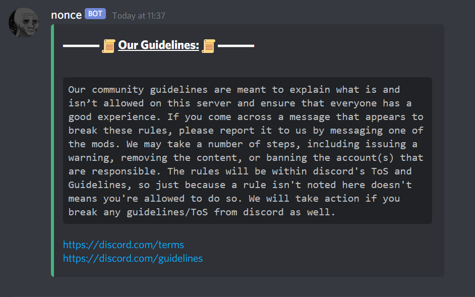
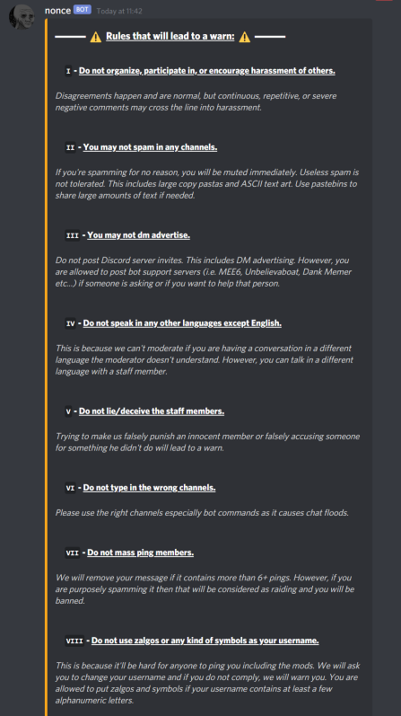
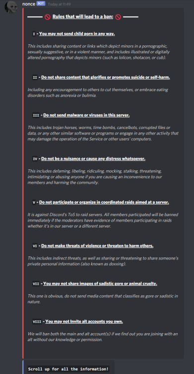

# **Discord-webhooks**
 Some simple json scripts to display a discord server's guidelines. It's not anything special lol, feel free to use for your own server if you want.
 
 ---

## **How to send webhooks**

> 1. To choose which channel you want to send your webhook, make sure to go to your rule channel where you want to send the webhook.
> 
> 2. go to `channel settings > integrations > create webhook` and choose the profile and username for the webhook.
> 
> 3. Copy the link on discord and paste it in a webhook manager site. Personally I use https://discord.club/dashboard, but you can choose any site as long as it allows json code inputs.
> 
> 4. Choose which webhook you want to send. All the scripts are in the [webhooks](https://github.com/Existential-nonce/Guideline-webhooks/tree/main/webhooks) folder. The normal order should be `Guidelines => Warns => Bans`, but you can choose the order if you feel like it.
> 
> 5. Copy and paste the json script into the code input in the site, then send them one by one. Due to character limits on discord, you'll need to send the warn and ban webhooks separatively. You can't send them all in one go.

---

## **Guidelines**

---

## **Warns**

---

## **Bans**
